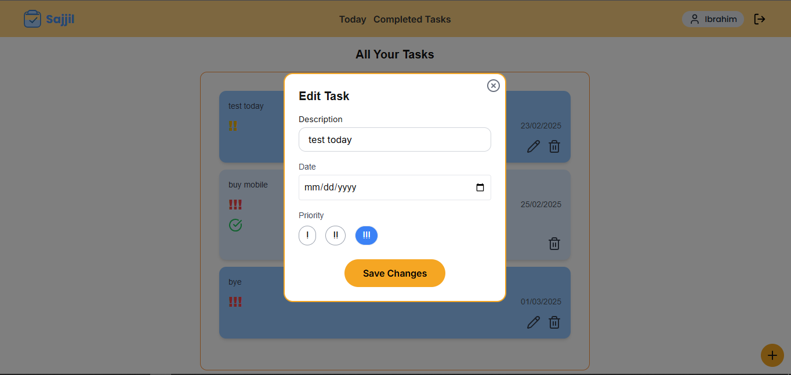
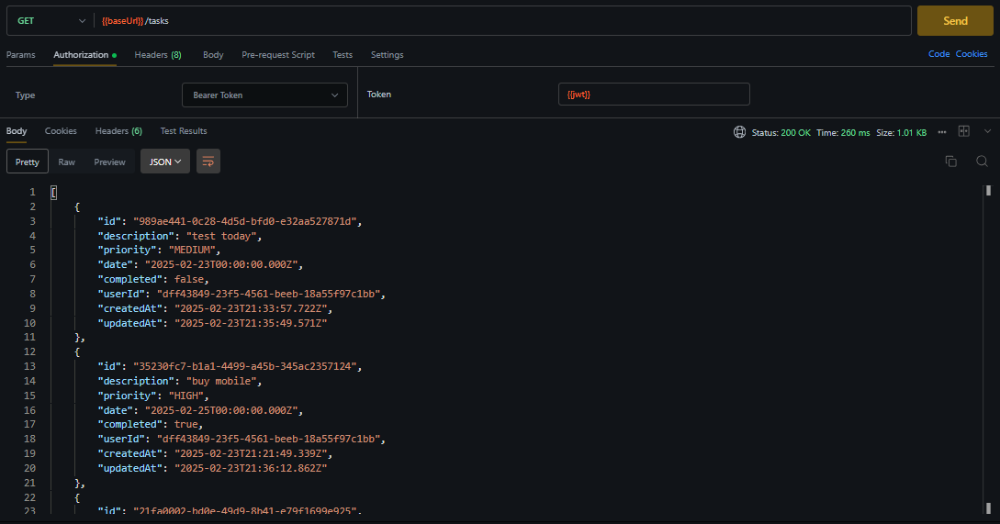

# Sajjil - Not your usual To-do Application

⚡ Sajjil: A simple yet powerful task management app built with modern web technologies.

**Done by:** Ibrahim Itani  

## Tech Stacks  

### Frontend

- **Framework:** [Next.js (App Router)](https://nextjs.org/)  
- **Language:** [TypeScript](https://www.typescriptlang.org/)  
- **State Management:** [Redux Toolkit](https://redux-toolkit.js.org/)  
- **Components:** Server Components (where possible), Reusable UI components  
- **Authentication & Security:** JWT-based authentication  

### Backend

- **Framework:** [NestJS](https://nestjs.com/)  
- **Database:** [PostgreSQL (Neon serverless)](https://neon.tech/)  
- **ORM:** [Prisma](https://www.prisma.io/)  
- **Authentication:** JWT-based authentication  
- **API Structure:** RESTful APIs with proper error handling  

## Figma  

- You can check the Figma design [here](https://www.figma.com/design/JY2eiAyC26vt3VH9fpznHL/Sajjil?node-id=0-1&t=jFaEKiTiGjFvoQ3Z-1).  

## UI Implementation  

| **Screen**           | **Screen**             |  
|----------------------|----------------------|  
| **Landing Page**     | **Login Page**       |  
|   |   |  
| **Dashboard Mobile** | **Dashboard Desktop** |  
|   |   |  
| **Edit Task**        | **Add Task**         |  
|   |   |  

---

## API Endpoints  

### Authentication

- `POST /auth/register` - Register a new user  
- `POST /auth/login` - Authenticate user and return a JWT token  

### Tasks

- `GET /tasks` - Get all tasks for the authenticated user  
- `POST /tasks` - Create a new task  
- `PUT /tasks/:id` - Update an existing task  
- `DELETE /tasks/:id` - Delete a task  

## Postman API Documentation  

- You can check the Postman collection [here](https://documenter.getpostman.com/view/41545410/2sAYdcsCkg).  

### Postman Screenshots (to see all apis images click [here](./readme/apis/))

| **Request**      | **Request**      |  
|------------------|------------------|  
| **Login API**    | **Register API**  |  
|   |   |  
| **Get Tasks**    | **Create Task**   |  
|   |   |  

---

## How to Run  

> To set up Sajjil locally, follow these steps:

### Prerequisites

First of all you need your runtime environment. Baddil uses "Bun" to be set up. You can install bun by running the following command:

- [bun](https://bun.sh/docs/installation)

  ```sh
    npm install -g bun
  ```

### Installation

_Below are instructions how to run Sajjil._

#### Common Steps:

1. Clone the repository:

    ```sh
        git clone https://github.com/IbrahimItani01/sajjil.git
    ```

2. Install dependencies

   ```sh
    bun install
   ```

#### Server-Side

1. Create your [NeonDB]("https://neon.tech/") serverless PostgreSQL database.

2. Visit the .env.example file and follow the key-naming structure.

3. To setup the database:

    ```sh
        cd ./prisma
        npx prisma generate
        npx prisma db push
    ```

#### Client-Side

1. Check in ./apis/main.ts the APIS_URL. Change its value to your server-side link.

**Now, you should be able to run Sajjil locally and explore its features!**
